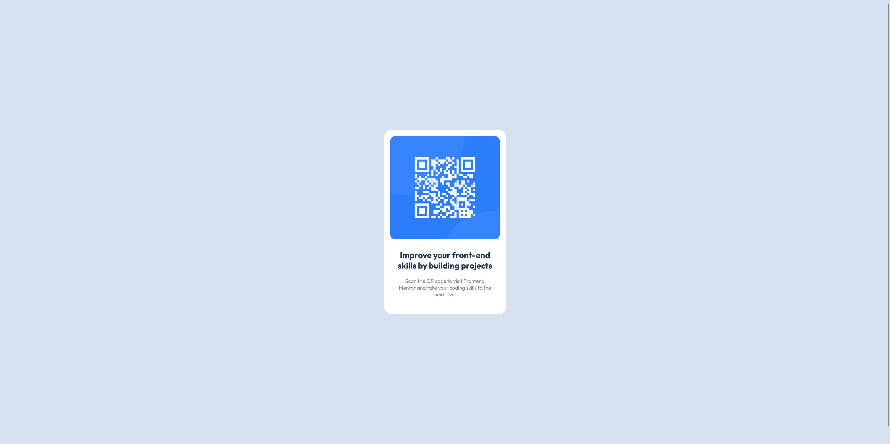
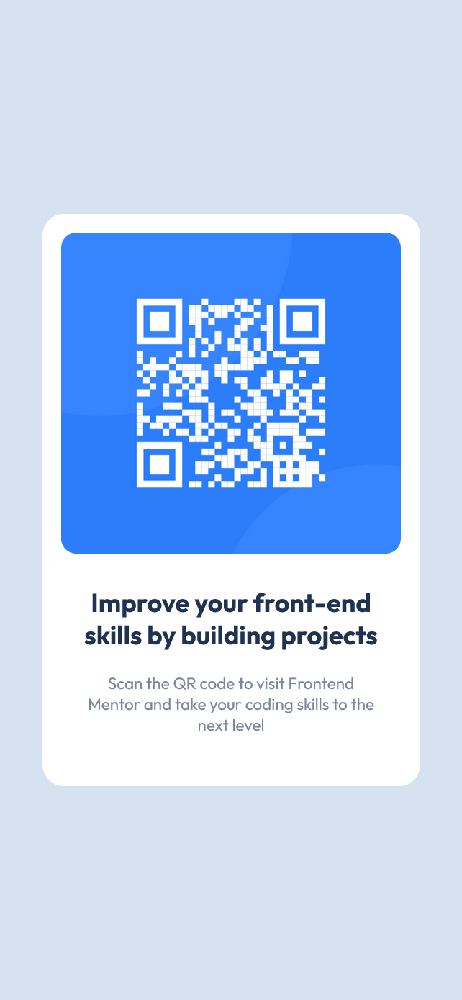

# 📱 QR Code Component

Repositório dedicado ao exercício ["QR Code Component"](https://www.frontendmentor.io/challenges/qr-code-component-iux_sIO_H) do site [Frontend Mentor](https://www.frontendmentor.io).

## 🎯Desafio

"A perfect first challenge if you're new to HTML and CSS. The card layout doesn't shift, so it's ideal if you haven't learned about building responsive layouts yet."

*(Um primeiro desafio perfeito se for novo em HTML e CSS. A disposição dos cartões não se altera, pelo que é ideal se ainda não aprendeu a criar disposições reactivas.)*

### ⚒️ Tecnologias utilizadas 
- HTML5
- CSS3

### 🤩 Resultado

- [Confira aqui o resultado!](https://fem-vn-qr-code-component.netlify.app)

### 📸 Screenshots

  
Desktop:

  
  </img>
     

  
Mobile:

  
  </img>

